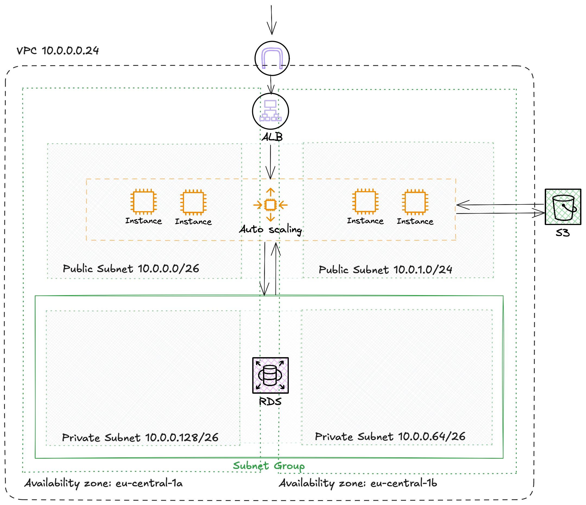

# Scalable WordPress Hosting on AWS with Terraform

This project provisions a highly available, scalable WordPress infrastructure on AWS using Terraform. It includes:

- A custom VPC with public and private subnets
- Application Load Balancer (ALB)
- Auto Scaling Group with EC2 Launch Template
- RDS MySQL database in private subnets
- S3 bucket for static website hosting
- IAM roles and policies for EC2 ↔ S3 access
- Optional NAT Gateway and Bastion Host (currently commented out)

---

## Getting Started

### 1. Clone this repository

Start by cloning this repository to your local machine:

```bash
git clone https://github.com/your-username/wordpress-terraform.git
cd wordpress-terraform
````

### 2. Configure your variables
Create a terraform.tfvars file in the project root or define variables manually when applying Terraform. Example content:

```bash
key_name     = "your-ssh-key-name"
db_name      = "wordpress"
db_user      = "admin"
db_password  = "your-secure-password"
```
🔐 Make sure to never commit sensitive data like passwords to version control.


### 3. Initialize and apply the infrastructure
Initialize the Terraform project and start the deployment:

```bash
terraform init
terraform apply
```
Confirm the plan with `yes` when prompted.


### 4. Access your services
#### WordPress (via Load Balancer)

After deployment, Terraform will output the DNS name of your ALB (Application Load Balancer). Open it in your browser to access your WordPress site.

#### Static Website (S3-hosted)

Visit your public static website hosted on S3:

`http://discogs-wordpress-fm-20250715.s3-website-eu-central-1.amazonaws.com`

Make sure that:

- `index.html` exists in your S3 bucket
- the bucket policy allows public read access


### 5. Upload static content (optional)
You can use the provided script to upload files to your S3 bucket:

`./bucket_upload.sh`

This syncs local static files to your S3 bucket for the website.

✅ You’re all set!
Your infrastructure is now live — scalable, accessible, and ready for WordPress.


## Infrastructure Overview

This diagram shows the architecture deployed by this Terraform configuration:

<p align="center">  </p>
📁 Project Structure

```bash
.
├── userdata/
│   └── wordpress.tpl.sh                          # EC2 boot script for WordPress installation
├── website/                                      # Static site content (optional)
├── bucket_upload.sh                              # Script to sync files to the S3 website bucket
├── main.tf                                       # Full infrastructure definition
├── variables.tf                                  # Input variables
├── outputs.tf                                    # Useful outputs (ALB DNS, etc.)
├── terraform.tfvars                              # Your variable definitions (ignored by git)

````

## Security Considerations

- EC2 instances are launched in public subnets (with public IPs)
- RDS is deployed in private subnets and is not publicly accessible
- S3 bucket is configured with public read access for static site hosting
- EC2 ↔ S3 access is managed securely via IAM roles (no hardcoded credentials)
- NAT Gateway and Bastion Host are defined but commented out for flexibility


## Cleanup

To destroy all deployed infrastructure:
`terraform destroy`
This will remove all AWS resources defined in the configuration.


## Author

Fanny Mayer


## Contributions

Contributions, suggestions, and issues are welcome! Feel free to open a PR or raise an issue to improve this project.


