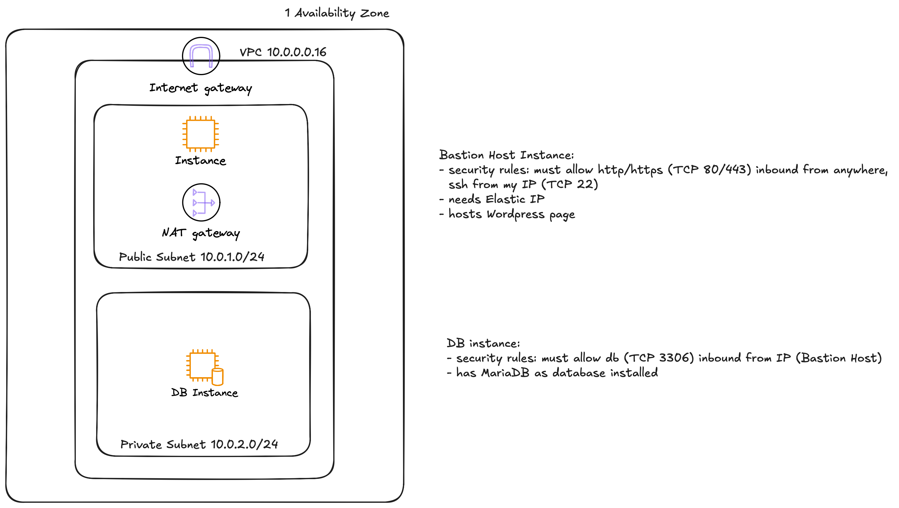

### Capstone_Project - Wordpress on AWS (Level 1)
This project sets up a secure and functional WordPress blog using **Terraform** on **AWS** as part of the Capstone Cloud Engineering Challenge. It includes a public EC2 instance running WordPress and a private EC2 instance running a MariaDB database in a private subnet, deployed inside a custom VPC with security group restrictions and infrastructure best practices.




---

## Project Structure

```bash
.
├── main.tf                   # Main Terraform configuration
├── userdata/
│   ├── wordpress.tpl.sh      # WordPress installation script (Bash)
│   └── db-setup.sh           # MariaDB setup script (Bash)
└── README.md                 # This file


## Architecture Overview

- VPC with public and private subnets
- Public EC2 instance (t3.micro):
  - Hosts Apache, PHP 8.1, and WordPress
  - Connected to Elastic IP
Private EC2 instance (t3.micro):
  - Runs MariaDB
  - Accessible only from Bastion host via Security Group rules
- NAT Gateway to allow the DB instance to update/install packages
- Elastic IPs for the NAT Gateway and WordPress instance


## Security Considerations

- SSH access is restricted to the user's public IP via the myip Terraform module.
- The WordPress instance has open HTTP access (port 80) for web traffic.
- The MariaDB instance only accepts traffic from the WordPress EC2 instance via Security Group.


## Usage

# 1. Prerequisites
- AWS CLI configured (aws configure)
- Terraform installed (v1.5+)
- Key pair created in AWS (vockey.pem) and referenced in main.tf
- SSH access from your IP (handled by the myip module)
# 2. Deployment
- terraform init
- terraform apply
- Note: Deployment takes ~1–2 minutes and will output the public IP to access WordPress.
# 3. Accessing WordPress
- After successful deployment, navigate to the public IP (e.g. http://<bastion_eip>) to complete the WordPress setup.


## Troubleshooting Tips

- PHP version mismatch: Make sure amazon-linux-extras enable php8.1 is included in wordpress.tpl.sh.
- Database connection error: Ensure DB credentials match and that the DB user allows remote connections ('wordpress'@'%').
- SSH blocked? Double-check the myip module and security group CIDRs.


## Learnings

This project demonstrates:
- VPC design & subnetting
- EC2 provisioning with userdata
- Secure database access patterns
- Use of Terraform modules and variables


## Next Steps (Level 2+ Ideas)

- Add ALB (Application Load Balancer)
- Migrate database to RDS
- Add Autoscaling Groups
- Multi-Availability-Zones Deployment
- Deploy own project in AWS Infrastructure 


## Author

Fanny Mayer – Cloud Engineering Trainee
-> Reach out via GitHub Issues if you have questions or feedback.

